1. ¿Cuántos camioneros tengo en plantilla?
**select count(*) from camionero;**
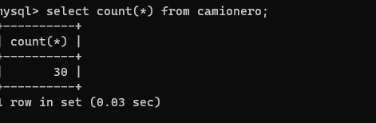

2. ¿Cuál es el salario máximo? ¿Quién lo cobra?
 **select nombre, max(salario) as salarioMasAlto from camionero group by nombre;**
 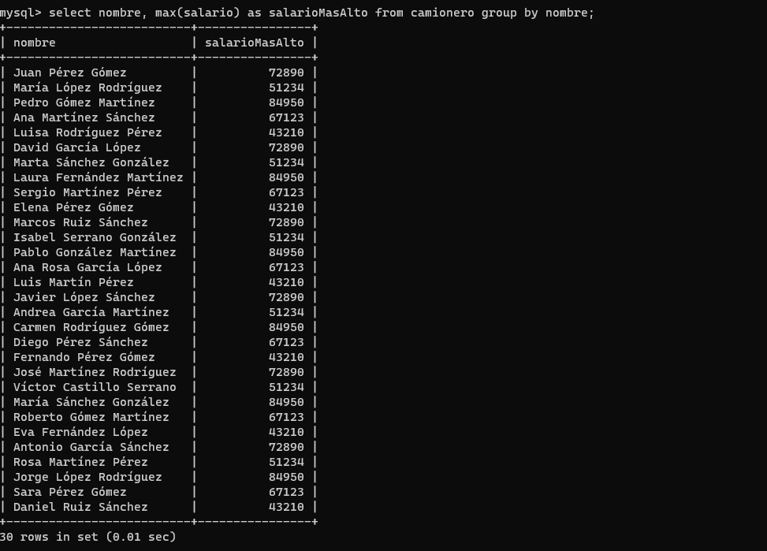

 3. ¿Cuántos camiones tengo en mi parque?
**select count(*) from camion;**
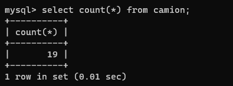

4. ¿De qué modelos son los camiones?
**select tipo, count(*) as numTipo from camion group by tipo;**
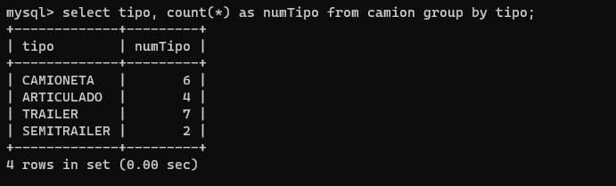

5. ¿Cuál es la descripción de todos los paquetes que son enviados a Barcelona (o a cualquier otra provincia dada de alta)?
**select descripcion from paquetes;**
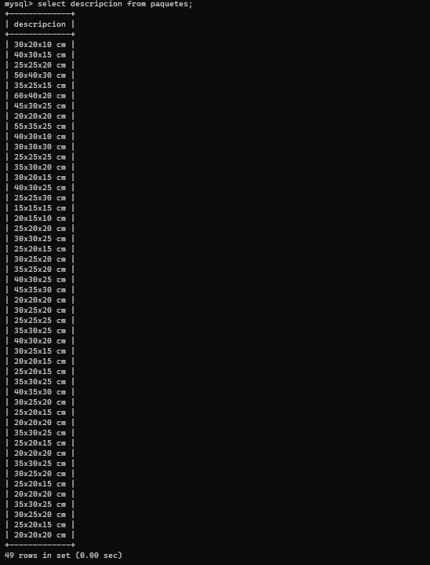
**select descripcion from paquetes group by provincia;**
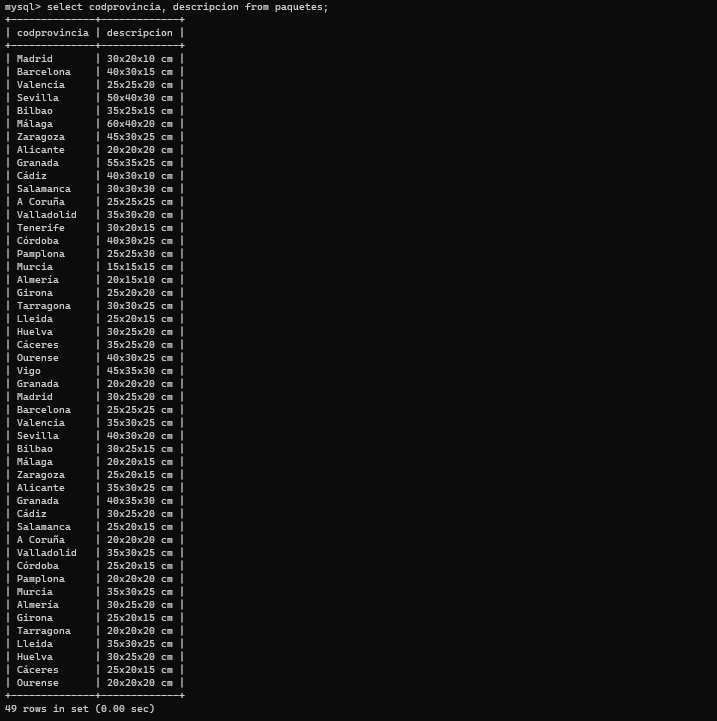

6. ¿Cuántos paquetes tienen a Cristina LM (o cualquier otro nombre) como destinatario?
**select destinatario, count(*) as descripcion from paquetes group by destinatario;**
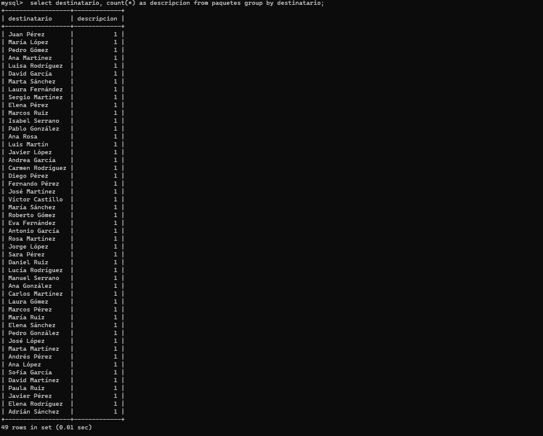

7. ¿Qué camiones ha conducido Juan PB (u otro camionero) en el último año?
  **select codcamionero, codcamion from conducir;**
  
  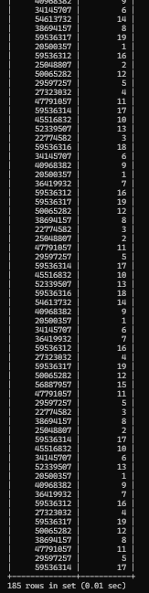

8. ¿De cuantos camioneros desconozco su lugar de residencia? ¿Quiénes son?
**select nombre from camionero where PoblacionResidencia is null;**
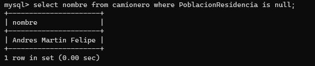

9. ¿Qué camión tiene la potencia máxima y cuál es?
**select max(potencia) as potenciaMáxima from camion;**
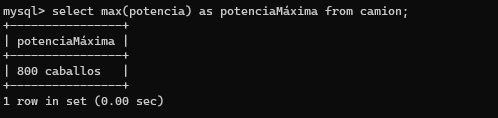

10. Eliminar el último paquete dado de alta, porque parece que contiene información
incorrecta.
 **select max(idpaquete) as ultimoPaquete from paquetes;**
 **delete from paquetes where idpaquete=50;**
 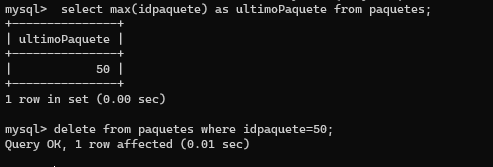

 11. ¿Qué camiones se condujeron entre dos fechas determinadas?
 **select CodCamion, FechaConduccion from conducir;**
 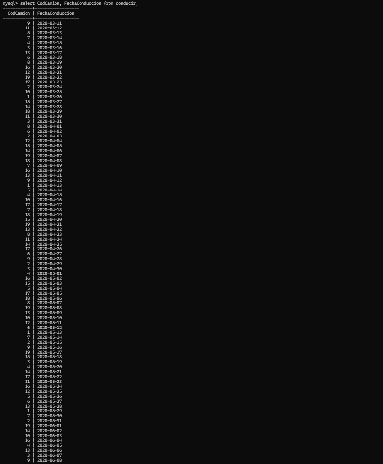
 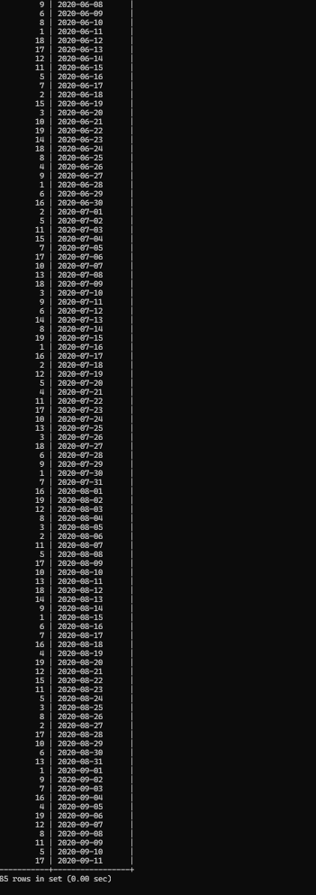

 12. ¿Cuál es la cuantía a pagar a final de mes a toda la plantilla?
 **select sum(salario) as TotalAPagar from camionero;**
 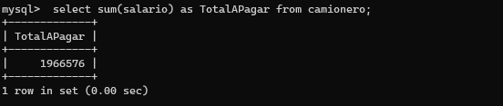

 13. Necesitamos una nueva característica en los paquetes, que nos diga de qué tipo son: si
urgentes, normales, o inmediatos (entrega en dos horas).
**alter table paquetes add velocidadEntrega enum ('urgentes','normales','inmediatos (entrega en dos horas)') default 'normales';**
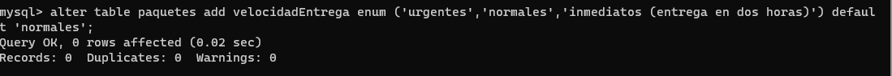

14. El primer paquete dado de alta, será urgente, los dos últimos inmediatos, y el resto (7
u 8) normales. Se puede utilizar el orden de las claves primarias en lugar del orden de
inserción (por si no se ha declarado claves autoincrementales).
**update paquetes set VelocidadEntrega=1 where idpaquete=1;**
**update paquetes set VelocidadEntrega=3 where idpaquete=50;**
**update paquetes set VelocidadEntrega=3 where idpaquete=49;**
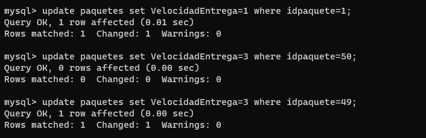

15. ¿Qué camioneros residen en Madrid con un sueldo superior a 3000? (ajustar provincia
y sueldo)
select nombre, where salario > 3000 where PoblacionResidencia = 28;

