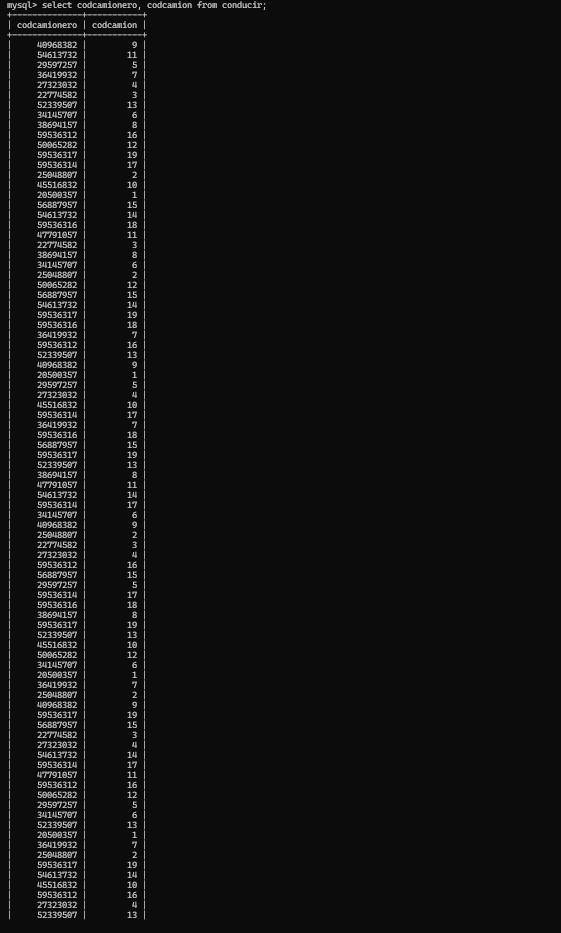

1. ¿Cuántos camioneros tengo en plantilla?

**select count(*) from camionero;**

2. ¿Cuál es el salario máximo? ¿Quién lo cobra?

 **select nombre, max(salario) as salarioMasAlto from camionero group by nombre;**
 

 3. ¿Cuántos camiones tengo en mi parque?

**select count(*) from camion;**

4. ¿De qué modelos son los camiones?

**select tipo, count(*) as numTipo from camion group by tipo;**

5. ¿Cuál es la descripción de todos los paquetes que son enviados a Barcelona (o a cualquier otra provincia dada de alta)?

**select descripcion from paquetes;**

**select descripcion from paquetes group by provincia;**

6. ¿Cuántos paquetes tienen a Cristina LM (o cualquier otro nombre) como destinatario?

**select destinatario, count(*) as descripcion from paquetes group by destinatario;**

7. ¿Qué camiones ha conducido Juan PB (u otro camionero) en el último año?

  **select codcamionero, codcamion from conducir;**
  
  

8. ¿De cuantos camioneros desconozco su lugar de residencia? ¿Quiénes son?

**select nombre from camionero where PoblacionResidencia is null;**

9. ¿Qué camión tiene la potencia máxima y cuál es?

**select max(potencia) as potenciaMáxima from camion;**

10. Eliminar el último paquete dado de alta, porque parece que contiene información
incorrecta.

 **select max(idpaquete) as ultimoPaquete from paquetes;**

 **delete from paquetes where idpaquete=50;**
 

 11. ¿Qué camiones se condujeron entre dos fechas determinadas?

 **select CodCamion, FechaConduccion from conducir;**
 
 

 12. ¿Cuál es la cuantía a pagar a final de mes a toda la plantilla?

 **select sum(salario) as TotalAPagar from camionero;**
 

 13. Necesitamos una nueva característica en los paquetes, que nos diga de qué tipo son: si
urgentes, normales, o inmediatos (entrega en dos horas).

**alter table paquetes add velocidadEntrega enum ('urgentes','normales','inmediatos (entrega en dos horas)') default 'normales';**

14. El primer paquete dado de alta, será urgente, los dos últimos inmediatos, y el resto (7
u 8) normales. Se puede utilizar el orden de las claves primarias en lugar del orden de
inserción (por si no se ha declarado claves autoincrementales).

**update paquetes set VelocidadEntrega=1 where idpaquete=1;**

**update paquetes set VelocidadEntrega=3 where idpaquete=50;**

**update paquetes set VelocidadEntrega=3 where idpaquete=49;**

15. ¿Qué camioneros residen en Madrid con un sueldo superior a 3000? (ajustar provincia
y sueldo)
select nombre from camionero where salario > 3000 and PoblacionResidencia = 28);
select dominancia, count(*) as numJug from jugadores group by dominancia having numJug>1;

16. ¿Cuántos paquetes no tienen descripción y van a Pontevedra? (ajustar provincia)

**select count(*) from paquetes where CodProvincia=34;**

17. Dar de alta un nuevo empleado con el sueldo 100 € superior, a la parte entera del
sueldo medio de los camioneros que ya existen en la empresa.

**select avg(salario) as TotalAPagar from camionero;**
**insert into CAMIONERO (DNI,Nombre,Telefono,Salario,PoblacionResidencia,Peso) values (22774593, "Juan Martin Lopez", 606778012, 63537.93, 15, 92);**

18. ¿De dónde son los empleados de mi plantilla? ¿Cuántos hay de cada una de las
poblaciones?

**select PoblacionResidencia, count(*) as Empleados from camionero group by PoblacionResidencia;**

19. Simular una posible bajada de sueldo de un 10%, que será enviada a los trabajadores,
anunciándoles que será revertida con el final de la crisis. Esperaremos a la respuesta
de aceptación para realizar la bajada real, si es que llega a producirse.

**select nombre, salario *0.9 as posibleBajada from camionero;**

20. Obtener un listado de las provincias registradas.

**select nombre, idprovincia from provincia;**

21. Generar, finalmente una bajada de sueldo del 5% sólo a los 6 camioneros de mayor sueldo

**select nombre, salario from camionero order by salario desc;**
**update camionero set salario=salario*0.9 where salario=84950;**

22. ¿Cuál es el sueldo medio de los camioneros de la empresa?

**select avg(salario) as SalarioMedio from camionero;** 

23. ¿Qué potencia media tienen los camiones de la empresa?

**select avg(potencia) as PotenciaMedia from camion;**

24. Número de viajes entre dos fechas concretas (en Navidades, en final de verano, …)

**SELECT count(*) FROM conducir WHERE FechaConduccion BETWEEN "2020-03-12" AND "2020-03-18";**

25. Número de viajes de un camionero en particular en un año.

**SELECT count(*) FROM conducir where codcamionero=27323032;**

26. ¿Cuántos paquetes se dirigen a Albacete?

**SELECT count(*) FROM paquetes where CodProvincia=2;**

27. ¿Cuál es la provincia registrada que recibe menos paquetes?

**select codprovincia, count(idpaquete) as paquetesContados from paquetes group by codprovincia order by paquetesContados;**

28. ¿Cuántos camioneros residen en Barcelona, y podrían pedir no trabajar el día del
Carmen?

**select count(*) from camionero where PoblacionResidencia="barcelona";**

29. Sabiendo el nombre de una provincia, ¿cuántos paquetes han sido enviados a ella?
mysql> SELECT COUNT(*) AS NumeroPaquetesEnviados

-> FROM Provincia

-> WHERE Nombre = 'Madrid';

+------------------------+

| NumeroPaquetesEnviados |

+------------------------+

| 1 |

+------------------------+

1 row in set (0.00 sec)

30. Obtener un listado de los códigos de todos los paquetes que tiene como destino
Albacete (o cualquier otra provincia)

mysql> SELECT CodigoPaquete

-> FROM Provincia

-> WHERE Nombre = 'Madrid';

+---------------+

| CodigoPaquete |

+---------------+

| 1 |

+---------------+

31. ¿Qué camión condujo Francisco JB el día 21/04/2018? (ajustar nombre y fecha a los
datos introducidos)

mysql> SELECT Camiones.matricula, Camiones.modelo

-> FROM Viajes

-> JOIN Camiones ON Viajes.matricula = Camiones.matricula

-> JOIN Camioneros ON Camiones.cod_camionero = Camioneros.dni

-> WHERE Camioneros.nombre = 'Francisco JB'

-> AND fechaInicio <= '2023-04-21'

-> AND fechaFin >= '2023-04-21';

Empty set (0.00 sec)

32. Obtener cuántos paquetes ha distribuido cada camionero de la plantilla (obteniendo
su nombre).

33. ¿Cuál es el nombre de los camioneros que han llevado paquetes a Lugo?

mysql> SELECT DISTINCT Camioneros.nombre

-> FROM Camioneros

-> JOIN Paquetes ON Camioneros.dni = Paquetes.cod_camionero

-> JOIN Provincia ON Paquetes.CodigoPaquete = Provincia.CodigoPaquete

-> WHERE Provincia.Nombre = 'Lugo';

Empty set (0.00 sec)

34. ¿Cuáles son las provincias que todavía no han recibido ningún paquete?

mysql> SELECT DISTINCT Nombre

-> FROM Provincia

-> WHERE Nombre NOT IN (

-> SELECT DISTINCT Nombre

-> FROM Provincia

-> JOIN Paquetes ON Provincia.CodigoPaquete = Paquetes.CodigoPaquete

-> );

Empty set (0.01 sec)

