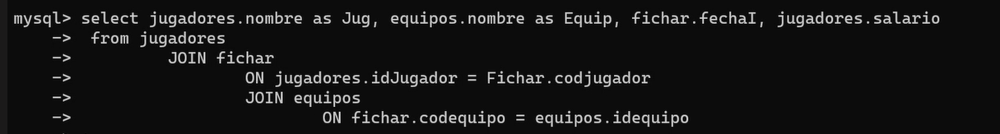

insert into jugadores(nombre, salario, fechaNac) values ('Pepe',50000, "2000/05/16");
 select * from jugadores;
insert into jugadores values(5, "Cristina", "2006/09/06", "defensa", 99999, "zurdo", 175, 68.5, "FRancia");
delete from jugadores; **vacia la tabla"**
drop jugadores; **la elimina**
delete from jugadores where nombre="pepe"; **borrara todos los datos de las filas relacionadas con pepe, por eso es mejor siempre con ID**
update jugadores set dominancia="diestro"; **cambia ese campo de toda la tabl**
update jugadores set dominancia="diestro" where idjugador="1"; **aqui se pouede usar y, or,....**
update jugadores set posición="delantero" where posición is null; **    asi se pone con null**
insert into equipos values (100, "los osos"),(200, "las aguilas"),(300, "los gatos") **inserto varios equipos a la vez**
select nombre, salario, posición from jugadores; **seleccion de datos de todos los jugadores, los campos que quiero**
select nombre, salario, posición from jugadores where nacionalidad="españa"; **lo mismo con condiciones, filtrado horizontal**
select * from jugadores order by salario; **filtramos la vista con un filtro, y sale predeterminado ascendetde**
select * from jugadores order by salario desc; **el desc s de descendente**
select * from jugadores order by salario desc, nombre; **pongo un segundo filtro**
select count(*) from jugadores where dominancia="diestro"; **ver cuantos elementos cumplenla condicion**
select count(*) as numDi from jugadores where dominancia="diestro"; **se le puede poner un alias**
 select dominancia, count(*) as numJug from jugadores group by dominancia; **el group by sirve para ver agrupaciones por campos de golpe**
select dominancia, count(*) as numJug from jugadores group by dominancia having numJug>1; **el having me sirve para hacer filtro adicionales**
**en la practica meter al menos 15 o 20 datos por tabla**   
select distinct(nacionalidad) from jugadores; **el distinc sirve para que no repita campos**
select count(altura) from jugadores; **si pone en los parentesesis el dato, solo te pone los que etnga dato**
select max(salario) as salarioMasAlto from jugadores; **filtro maximo**
select nombre from jugadores where salario=(select min(salario) as salarioMasBajo from jugadores); **ejemplo de combinacion de queries**
 select sum(salario) as TotalAPagar from jugadores; **formula de suma**
 select avg(salario) as TotalAPagar from jugadores; **formula de media: average**
 select sum(salario) / count(salario) as MediaSueldo from jugadores; **y se pueden combiar y hacer operacione matecicas simple**
 select nacionalidad, avg(salario) as TotalAPagarrrrr from jugadores group by nacionalidad;
select nombre, salario *1.1 as posibleSubida from jugadores; **columna calcula, una creada a traves de una columna de la tabla, solo es una visualizacion, no existe en la tabla fisica**
update jugadores set salario=salario*1,1; **tb se pueden usar las formulas en la update**
<> operador distinto, ^ operador potencia...se pueden usar todos los operadores nmormales
select * from jugadores where nombre like "M%";   **expresion regular con el like, el % es le simbolo de 1 o mas caracteres**
select * from jugadores where nombre like "J___"; **cada _ es un caracter adicional**
**hay mas funcionanes matematicas y de fechas**
select concat(nombre, "juega de", posición) from jugadores; **se puede maquear la salidad con diferentes metodos**
 select dayname("1978/11/02"); **sacar dia de nacimiento**
 select nombre, dayname(fechanac) as dia, fechanac from jugadores; **ejemplo busqueda**
  select datediff(now(), "1978/11/02") as numdiavida;
  select datediff(now(), "1978/11/02")/365 as numañosvida;
   select ceiling(datediff(now(), "1978/11/02")/365) as numañosvida2024;
    insert into estadios(idestadio, nombre, codequipo) values (1003, "el nido", 200),(2056, "el colchon", 300); **insereto estadios**
    select estadios.nombre as EST, equipos.nombre as EQUIP from equipos JOIN estadios ON idequipo=codequipo; **combina datos de las dos tabalas con el comando join, y tras el on, iguyala la foranea con la primary**

    <!-- --falta poner aqui la busqueda a tres, no me dio tiempo a copiar-- -->

